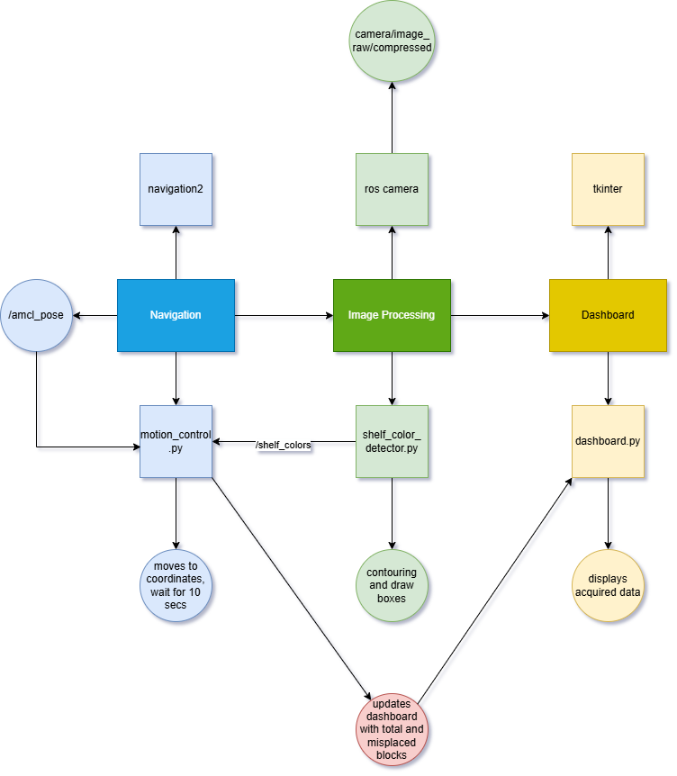
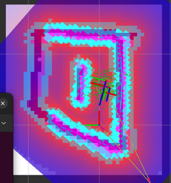
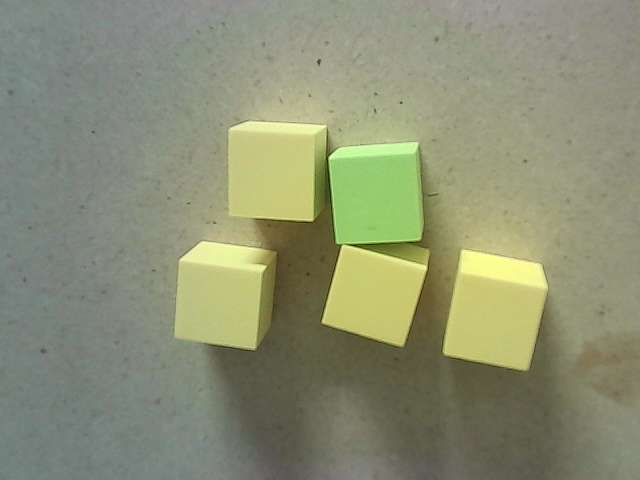
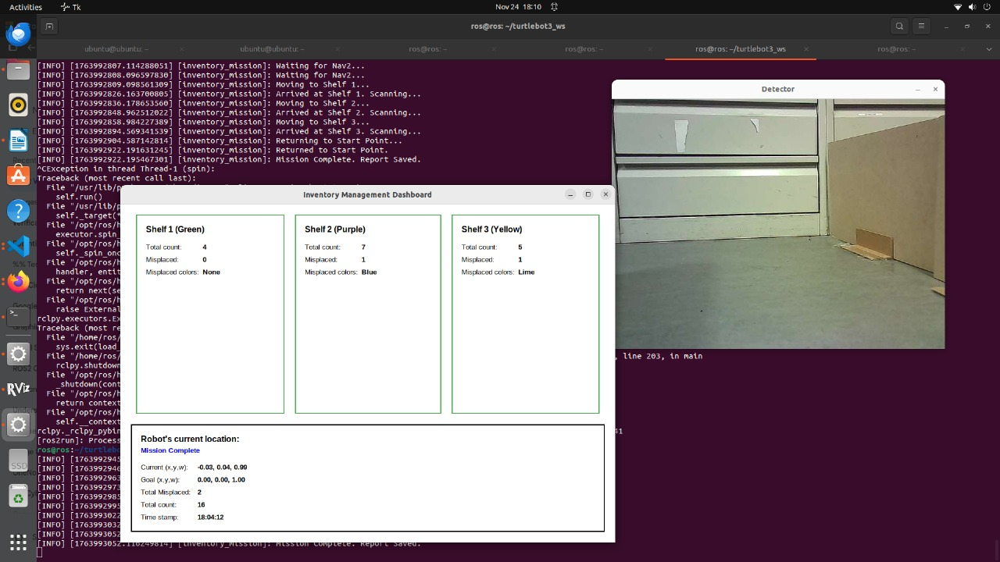
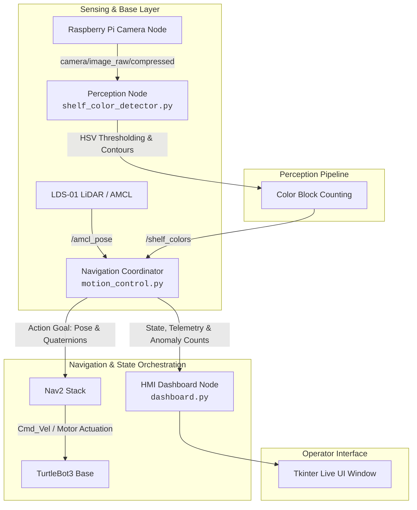

# Autonomous Warehouse Inventory & Inspection Robot 🤖📦

[](https://docs.ros.org/en/humble/)
[](https://python.org)
[](https://opencv.org/)
[](https://navigation.ros.org/)
[]()
[](LICENSE)

> An autonomous robotic inspection system engineered on **ROS 2 Humble** and a **TurtleBot3 Burger**[cite: 1]. Integrates Cartographer SLAM, Nav2 waypoint navigation, real-time HSV color segmentation via OpenCV, and a multi-threaded Tkinter operator dashboard to automate inventory tracking and detect misplaced warehouse stock[cite: 1].

📄 **[Read the Full Technical Report (PDF)](docs/ECTE477_Project_Report.pdf)**[cite: 1]

---

## 🎬 System Demos & Visuals

| Functional Block Diagram | 2D Occupancy Grid Map | Nav2 Costmap & AMCL Localization |
| :---: | :---: | :---: |
|  |  |  |
| *Multi-node ROS 2 messaging architecture*[cite: 1] | *Cartographer SLAM generated map (`map.yaml`)*[cite: 1] | *Costmap inflation layers & AMCL particle filter swarm*[cite: 1] |

| Target Inventory Blocks | Live Dashboard & Telemetry Results |
| :---: | :---: |
|  |  |
| *Target color-coded payload blocks*[cite: 1] | *Live Tkinter GUI with shelf totals & misplaced item alerts*[cite: 1] |

---

## 🏗️ System Architecture & Node Communication

The system is decoupled into three modular sub-systems communicating via ROS 2 topics, action servers, and local sockets[cite: 1]:



---

## ⚡ Key System Features

* **Autonomous Waypoint Navigation:** Dispatches goal poses to the **Nav2 Action Server** using coordinates mapped via Cartographer SLAM and verified against `/amcl_pose`[cite: 1].
* **Real-Time Color Segmentation & Contouring:** Subscribes to `/camera/image_raw/compressed`, applies calibrated HSV ranges across 5 color bands (Yellow, Lime, Green, Purple, Blue), and executes morphological opening operations to isolate and count inventory blocks[cite: 1].
* **Costmap-Aware Obstacle Clearance:** Utilizes local and global inflation costmaps with AMCL particle-filter state estimation to dynamically navigate tight warehouse corridors without collisions[cite: 1].
* **Synchronized Inspection Hold:** Implements an automated 10-second stabilization hold state at each shelf waypoint to settle camera motion blur and ensure reliable perception aggregation before continuing the route[cite: 1].
* **Live Telemetry & Diagnostics GUI:** Multi-threaded **Tkinter** dashboard showing real-time shelf status cards, active robot coordinates, target navigation goals, and misplaced item alerts[cite: 1].

---

## 📂 Package & Node Breakdown

### 1. `inventory_control` (Core Application Package)[cite: 1]
* **`motion_control.py`**: Central state coordinator[cite: 1]. Manages the waypoint queue, interfaces with the Nav2 action client, processes `/shelf_colors` message payloads, and pushes live updates into the GUI[cite: 1].
* **`shelf_color_detector.py`**: OpenCV perception pipeline[cite: 1]. Performs color masking, noise removal, and contouring, publishing structured item counts to `/shelf_colors`[cite: 1].
* **`dashboard.py`**: Operator interface displaying live status cards for each shelf (Green, Purple, Yellow), active robot coordinates $(x, y, w)$, target goals, and total misplaced item counts[cite: 1].

### 2. `oas_pkg` (Hardware Integration & Support Nodes)
* **`lidar_sub.py`**: Laser scan subscriber for direct distance monitoring.
* **`wall_stopper.py`**: Reactive collision avoidance and emergency stop script.
* **`move_tb3_circle.py`**: Open-loop kinematic calibration routine.

---

## 🔧 Engineering Challenges & Debugging

| Challenge Encountered | Root Cause | Engineering Solution |
| :--- | :--- | :--- |
| **Target Heading Drift**[cite: 1] | Network transmission delays over Wi-Fi during goal-point handoffs caused the robot to undershoot its final angular orientation[cite: 1]. | Manually calibrated and overcompensated the target quaternion orientation value ($w$) within the waypoint lookup dictionary to guarantee reliable alignment with shelves[cite: 1]. |
| **Color Bleed / False Positives**[cite: 1] | Ambient lighting variations caused adjacent HSV boundaries (e.g., lime vs. green) to overlap[cite: 1]. | Utilized an interactive trackbar utility (`range_detector.py`) to tune non-overlapping thresholds and applied morphological opening filters[cite: 1]. |
| **Deceleration Blur**[cite: 1] | Deceleration dynamics caused camera shake when taking images immediately upon stopping[cite: 1]. | Introduced a 10-second stabilization pause in `motion_control.py` to allow robot dampening before image analysis begins[cite: 1]. |

---

## 🚀 Installation & Reproduction Guide

### 1. Hardware Bringup (SSH into TurtleBot3)[cite: 1]
```bash
# Connect to the onboard Raspberry Pi
ssh ubuntu@<robot_ip>

# Launch core motor drivers and camera publisher
ros2 launch turtlebot3_bringup robot.launch.py
ros2 launch camera_ros camera.launch.py
```

### 2. Launch Navigation on Host PC[cite: 1]
```bash
# Launch Nav2 with the generated occupancy grid
ros2 launch turtlebot3_navigation2 navigation2.launch.py map:=/path/to/maps/map2.yaml
```

### 3. Build & Run Inventory Pipeline[cite: 1]
```bash
# Clone and build package
cd ~/turtlebot3_ws
colcon build --packages-select inventory_control
source install/setup.bash

# Run perception, dashboard, and motion control nodes
ros2 run inventory_control shelf_color_detector &
ros2 run inventory_control dashboard &
ros2 run inventory_control motion_control
```

---

## 👨‍💻 Author & Contact
* **Osaid** - *MEng ECE Candidate, University of Waterloo*
* **Profile:** [LinkedIn](https://linkedin.com/in/) • [GitHub](https://github.com/)
